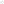

# umol

umol is an experimental molecular representation and manipulation library in Rust
with Python bindings. Two extensions to the conventional molecular graph model
are introduced. The molecular graph itself consists only of atoms and localized
bonds, while aromatic systems, stereochemistry, coordination and multicenter bonds,
and noncovalent interactions are represented by typed relations overlays.
The atom, bond, and overlay attributes form a lattice, which allows to represent
concrete molecules and patterns by the same type `Molecule`. Similarly, `Reaction`
represents both specific reactions and transformation rules. Strict definitions
of the molecular graph and overlays admit algebraic laws that are checked by property
testing.

umol does not enforce a fixed definition of a valid molecule. Instead, chemistry models
define admissible valence states, aromaticity, and stereochemistry. The umol library
provides format ingestion, substructure matching, fingerprints, canonicalization,
structural editing and transactions, reaction application and composition, and SVG
depiction. This guide introduces the Python interface, followed by a Rust example.

## Getting started

Install the distribution `umol-py`, which provides the import package `umol`:

```console
pip install umol-py
```

Version 0.8.0 is an alpha release; interfaces may still change. See the
[release notes](https://github.com/dayhofflabs/umol/blob/main/RELEASE_NOTES.md)
for changes since 0.7.0, including API migration guidance. The
[whitepaper](https://github.com/dayhofflabs/umol/blob/main/docs/umol-whitepaper.pdf)
develops the molecular model and its algebra.

## Reading and writing molecules

SMILES ingestion parses the input and resolves implicit details under a default
chemistry model, including hydrogens, charge, and unpaired electrons:

```python
from umol import Molecule

mol = Molecule.from_smiles("CCO")  # ethanol: 3 atoms, 2 bonds
text = mol.render()                # umol notation; str(mol) is equivalent
```

MOL and SDF ingestion is also available. Structures with more general bonding
can be written directly in umol's notation. Diborane has four terminal B–H
bonds and two three-center, two-electron bonds:

```python
diborane = Molecule.parse("""
  {:atoms ["B" "H" "B" "H" "H" "H" "H" "H"]
   :bonds [[0 4 "1"] [0 5 "1"] [2 6 "1"] [2 7 "1"]]
   :multicenter-bonds [{:atoms [0 1 2] :attrs "[1,1,0]"}
                       {:atoms [0 3 2] :attrs "[0,1,1]"}]}
""")
```

The multicenter overlays record the participating atoms and their individual
electron contributions. Parsing umol notation preserves the specified
attributes; it does not implicitly resolve them under a chemistry model.

Aliases and other notation metadata can be retained explicitly across a round trip:

```python
named, metadata = Molecule.parse_with_metadata('{:atoms [[:oxygen "O#h2"]]}')
text = named.render_with_metadata(metadata)
```


## Drawing molecules and reactions

`depict()` generates a two-dimensional layout using the
[CoordGen](https://github.com/schrodinger/coordgenlibs) library. The resulting
`Depiction` renders as SVG text and displays directly in Jupyter:

```python
from pathlib import Path

adenine = Molecule.from_smiles("NC1=NC=NC2=C1N=CN2")  # 9H-adenine, Kekulé form
drawing = adenine.depict()
Path("adenine.svg").write_text(drawing.render_svg(), encoding="utf-8")
```



The black-and-white renderer includes atom annotations, tetrahedral wedges and
hashes, cis/trans geometry, and aromatic-system contours. Reactions provide the
same depiction methods.

## Choosing a chemistry model

A chemistry model determines the range of valid molecules. For example, this
atom-typing registry accepts trivalent phosphorus and rejects pentavalent
phosphorus:

```python
from umol import (
    AtomTypeRegistry, ChemistryModel, ValenceCandidateSource,
    ValenceModel, ValenceTieBreak,
)

registry = AtomTypeRegistry.from_toml("""
[P]
0 = ["P #n #v3"]
[F]
0 = ["F #n3 #v"]
""")

default = ChemistryModel.default()
strict = ChemistryModel(
    connectivity=default.connectivity,
    valence=ValenceModel(
        candidates=ValenceCandidateSource.AtomTyping(registry=registry),
        tie_break=ValenceTieBreak.Strict,
    ),
    aromaticity=default.aromaticity,
    stereo=default.stereo,
)

accepted = Molecule.from_smiles("FP(F)F", chemistry_model=strict)
# Molecule.from_smiles("FP(F)(F)(F)F", chemistry_model=strict)
# raises ContradictionError:
# no atom-typing match for AtomId(1) (element P, charge Some(0))
```

Atom typing enumerates admissible valence states. The alternative counts-based
candidate source uses saturation targets for implicit hydrogen filling; those
targets are not an exhaustive list of admissible atom types.

## Substructure search

A pattern is a molecule with open attribute definitions. These patterns
distinguish the nitrogen atoms in histidine by their aromatic contribution:

```python
histidine = Molecule.from_smiles("O=C([C@H](Cc1c[nH]cn1)[NH3+])[O-]")

pyrrole_n = Molecule.parse('{:atoms ["N#a2"]}')  # contributes two pi electrons
pyridine_n = Molecule.parse('{:atoms ["N#a"]}')  # contributes one
aromatic_n = Molecule.parse('{:atoms ["N#a+"]}') # any aromatic contribution
any_n = Molecule.parse('{:atoms ["N"]}')

len(pyrrole_n.substructure_matches(histidine))   # 1
len(pyridine_n.substructure_matches(histidine))  # 1
len(aromatic_n.substructure_matches(histidine))  # 2
len(any_n.substructure_matches(histidine))       # 3, including ammonium
```

Each match is a correspondence from pattern entities to host entities.
`match.atoms.matched_pairs` contains atom pairs; `match.bonds`,
`match.aromatic_systems`, and the other components cover the remaining families.

Algorithm choice can be configured explicitly. This example matches through the
incidence graph using Ray–Kirsch subgraph isomorphism:

```python
from umol import (
    SubstructureSearchConfig, SubstructureMatchAlgorithm,
    SubgraphIsomorphismAlgorithm,
)

search = SubstructureSearchConfig(
    match_algorithm=SubstructureMatchAlgorithm.Incidence(),
    subgraph_isomorphism_algorithm=SubgraphIsomorphismAlgorithm.RayKirsch(),
)
matches = aromatic_n.substructure_matches(histidine, config=search)
```


## Fingerprints and canonicalization

Compute ECFP4 fingerprints and compare their folded bit vectors:

```python
from umol import HashedFingerprintConfig

ecfp = HashedFingerprintConfig.Ecfp(radius=2)
a = Molecule.from_smiles("CCO").hashed_fingerprint(config=ecfp).fold(2048)
b = Molecule.from_smiles("COC").hashed_fingerprint(config=ecfp).fold(2048)
similarity = a.tanimoto(b)  # approximately 0.1111
```

Feature generation and folding are separate operations. ECFP feature identifiers
use a fixed, versioned 64-bit hashing scheme.

Canonicalization provides a common representation for equivalent structures:

```python
same = mol.canonical_eq(Molecule.from_smiles("OCC"))  # True
canonical = mol.canonicalize()
```

Canonical representatives may change between 0.x releases. They are not
persistent identifiers.

## Combining and splitting

Combination forms a disjoint union; splitting recovers its connected components:

```python
ammonia = Molecule.from_smiles("N")
hydrogen_chloride = Molecule.from_smiles("Cl")

combined = ammonia.combine(hydrogen_chloride)
components = combined.split()  # two Molecule values
```

Existing entity ids are preserved by combination, and each appended entity family
follows the corresponding family of the left operand.

## Applying reactions

A reaction can be read from mapped reaction SMILES or from umol notation.
This Paal–Knorr cyclization converts hexane-2,5-dione into a substituted furan
and water:

```python
from umol import Reaction

rule = Reaction.from_reaction_smiles(
    "[CH3:1][C:2](=[O:3])[CH2:4][CH2:5][C:6](=[O:7])[CH3:8]"
    ">>[CH3:1][c:2]1[cH:4][cH:5][c:6]([CH3:8])[o:3]1.[OH2:7]"
)
diketone = Molecule.from_smiles("CC(=O)CCC(=O)C")

products = list(rule.apply(diketone))  # two applications, one for each symmetric match
```

To also obtain the correspondence from the host to a product, use `tracked_apply`:

```python
product, correspondence = next(rule.tracked_apply(diketone))
```

Each product is one graph containing both the furan and water. To obtain separate
product components per match, use `react`:

```python
product_sets = list(diketone.react(rule))
len(product_sets[0])  # 2: furan and water
```

`Molecule.react_all(reactants, rule)` combines several reactants before applying
the rule and splitting its products.

## Composing reactions

Composition constructs a reaction for each admissible overlap between the first
reaction's product side and the second reaction's reactant side. Given reactions
`first` and `second` and a host molecule `host`:

```python
composites = first.compose(second)
```

Applying the composite reactions gives the same set of products as applying the
two reactions in sequence:

```python
sequential = {
    str(product.canonicalize())
    for intermediate in first.apply(host)
    for product in second.apply(intermediate)
}
composed = {
    str(product.canonicalize())
    for composite in composites
    for product in composite.apply(host)
}
sequential == composed  # True
```

The comparison uses sets of canonical products. The two routes can produce
different multiplicities through symmetry or repeated overlaps.

## Using umol in Rust

The crates separate representation, chemistry operations, graph algorithms,
and external formats. A small application that reads and depicts a molecule
needs:

```toml
[dependencies]
umol-graph = "0.8.0"
umol-graph-ir = "0.8.0"
umol-io = { version = "0.8.0", features = ["depiction"] }
```

```rust
use std::error::Error;
use std::fs;
use umol_graph::ingest;
use umol_graph_ir::ir::Molecule;
use umol_io::depict::Depict;

fn main() -> Result<(), Box<dyn Error>> {
    let molecule = ingest::ingest_smiles("CCO")?;
    let pattern: Molecule = r#"{:atoms ["O"]}"#.parse()?;
    println!("{molecule}");
    println!("{pattern}");
    fs::write("ethanol.svg", molecule.depict()?.render_svg())?;
    Ok(())
}
```

Depiction enables the vendored CoordGen build and requires a C++11 compiler.
Prebuilt Python wheels include the native implementation.

The Rust API references are organized by crate:
[graph IR](https://docs.rs/umol-graph-ir),
[chemistry operations](https://docs.rs/umol-graph),
[graph algorithms](https://docs.rs/umol-graph-core), and
[format IO and depiction](https://docs.rs/umol-io).

## External libraries

umol uses [nauty](https://pallini.di.uniroma1.it/) (licensed under Apache 2.0 license),
from Brendan McKay and Adolfo Piperno's nauty and Traces project, for graph automorphism
computation and canonical labeling. Two-dimensional molecular layouts use
[CoordGen](https://github.com/schrodinger/coordgenlibs) (licensed under BSD 3 Clause
license), developed by Schrödinger. Versions, source provenance, and license locations are
recorded in the [third-party code inventory](docs/third-party-code.md).

## License

Except where a crate states otherwise, umol is available under either the
[Apache License 2.0](https://github.com/dayhofflabs/umol/blob/main/LICENSE-APACHE)
or the [MIT license](https://github.com/dayhofflabs/umol/blob/main/LICENSE-MIT),
at your option. Vendored sources and licenses are recorded in the
[third-party provenance document](https://github.com/dayhofflabs/umol/blob/main/docs/third-party-code.md).
