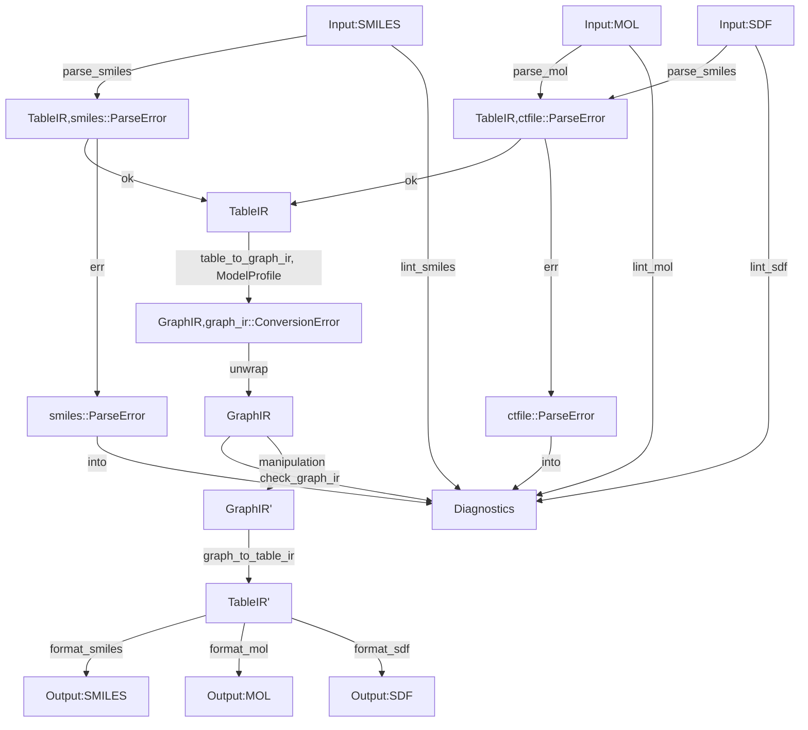

# Diagram

Proposed layout for the parsing / linting infra for graph-structure molecular data.

```mermaid
flowchart
    Input:SMILES --> |parse_smiles| TableIR,smiles::ParseError
    Input:MOL --> |parse_mol| TableIR,ctfile::ParseError
    Input:SDF --> |parse_smiles| TableIR,ctfile::ParseError
    TableIR,smiles::ParseError --> |ok| TableIR
    TableIR,ctfile::ParseError --> |ok| TableIR
    TableIR,smiles::ParseError --> |err| smiles::ParseError
    TableIR,ctfile::ParseError --> |err| ctfile::ParseError
    smiles::ParseError --> |into| Diagnostics
    ctfile::ParseError --> |into| Diagnostics
    TableIR --> |table_to_graph_ir, ModelProfile| GraphIR,graph_ir::ConversionError
    GraphIR,graph_ir::ConversionError -->|unwrap| GraphIR
    GraphIR --> |check_graph_ir| Diagnostics
    GraphIR --> |manipulation| GraphIR'
    GraphIR' --> |graph_to_table_ir| TableIR'
    TableIR' --> |format_smiles| Output:SMILES
    TableIR' --> |format_mol| Output:MOL
    TableIR' --> |format_sdf| Output:SDF
    Input:SMILES --> |lint_smiles| Diagnostics
    Input:MOL --> |lint_mol| Diagnostics
    Input:SDF --> |lint_sdf| Diagnostics
```