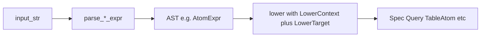

# Molecule DSL

## Preface

The DSL rests on three connected ideas.

**Homoiconicity.** Data and patterns share notation. A ground molecule and a substructure
query differ only in whether their attribute slots contain concrete values or constraint
expressions. An atom spec `Cv4H2` and an atom query `C?v4H*` share the same grammar;
the spec is a degenerate query that matches exactly one atom type. This collapses the
usual asymmetry between data formats and query languages, and is the reason that a single
representation covers both `Molecule`/`MoleculeBuilder` objects and query objects.

**Relational structure.** A molecule is a set of named relations — an atom relation, a
covalent-bond relation, a dative-bond relation, an aromatic-system relation, and so on —
matching `MoleculeBuilder`'s fields directly. Each relation is a collection of typed
tuples. Fragment composition is relation union. Substructure matching is relational
containment.

**EDN + Datalog.** EDN (Extensible Data Notation) represents the relational structure
natively: a molecule is an EDN map whose keys are relation names and whose values are
vectors of tuples. The semantic operations — matching, transformation, resolution — are
instances of Datalog-with-arithmetic evaluation: rules of the form
`LHS-pattern → RHS-pattern` with bound variables and arithmetic guards. EDN is the data
layer; the rule evaluator is the computation layer. No JVM is required: `edn-rs` is vendored as the host EDN reader (see O13); the Datalog
rule evaluator is part of umol itself.


## Term algebra

Four levels, defined by mathematical structure.

### Level 1 — Ground terms

Fully resolved molecules. All attribute slots are concrete values. Extension = singleton.
Values of type `Molecule`.

```edn
{:umol/kind    :molecular-graph
 :umol/version 1
 :atoms   {:c #atom "CH3v1"  :o #atom "OH/2v1"}
 :bonds   [[:c :o :single]]
 :charge  0
 :spin    #spin "^0x1"}
```

### Level 2 — Constraint terms

Predicates over the countably infinite discrete set of all chemical graphs. Some attribute
slots contain wildcards, variable bindings, or guards. Extension = arbitrary (possibly
infinite) subset of chemical space.

```edn
{:atoms   {:c1 #atom "C?v4H*"  :o1 #atom "O?v*H*"}
 :bonds   [[:c1 :o1 :single]]
 :charge  nil
 :spin    nil}
```

**Partial structures and queries are the same object.** Both are constraint terms. The
distinction is purely in the evaluation context:

- *Builder context*: the term is expected to narrow to a singleton under resolution.
  `MoleculeBuilder` fails if the constraint is underdetermined after all resolution passes.
- *Query context*: the term selects an arbitrary-sized subset. The same constraint term
  that fails as a builder spec may be a valid substructure query.

Within level-2 semantics, the atomic properties provided in the #atom token are treated
as exact match predicates, wildcards define constraints. Moreover, variables, expressions,
and guards are allowed.

### Level 3 — Rules

Pairs `{:lhs <constraint-term> :rhs <constraint-term>}`. The LHS is matched against a
molecule (or multiset of molecules for n-ary rules); the RHS is constructed from the
match, with LHS-bound variables in scope.

```
unimolecular:  Molecule → Option<Set<Molecule>>
n-ary:         MultiSet<Molecule> → Option<Set<MultiSet<Molecule>>>
```

`None` = LHS did not match. The output is a set because a match may produce multiple
valid products (e.g. multiple Kekulé structures, multiple tautomers).

**Manipulations and reactions are the same type.** Kekulization, tautomerization,
aromatization, and named reactions all have this signature. The distinction is purely
about LHS specificity:

| LHS | Example |
|---|---|
| Structural motif | Kekulization (any aromatic system) |
| Reaction template | Alcohol oxidation (any primary or secondary alcohol) |
| Fully determined molecule | A specific named substrate |

Variables bound on the LHS may appear in arithmetic expressions on the RHS (see
[Grammar — arithmetic in rules](#arithmetic-in-rules)).

For n-ary rules, `:lhs` is a vector of constraint terms; atom labels are namespaced to
distinguish reactant molecules (`:mol1/c1`, `:mol2/c3`).

### Level 4 — Compound terms

EDN lists representing function application. Arguments may be any level-1–3 terms or
further compound terms.

```clojure
(apply-rule oxidize-alcohol methanol)
(mix (enantiomer mol) (invert-all (enantiomer mol)))
(fuse benzene pyrrole {:benzene/c3 :pyrrole/c0})
(select-tautomer lactam criterion/lowest-energy)
```

Return types are ground terms, sets of ground terms, or further compound terms. Level-4
terms are EDN lists, not molecule maps; they are computation above the data layer and do
not alter the molecule map schema.


## Grammar

### Molecule map schema

```
molecule-map ::=
  { :atoms    atom-collection
    :bonds    bond-list
    [:dative   bond-list]
    [:aromatic aromatic-list]
    [:mc       mc-list]
    [:nc       bond-list]
    [:charge   int | nil]
    [:spin     spin-literal | nil]
    [:expect   { :charge int :multiplicity keyword }]   ; test checksum only
    [:guards   [ logic-expr* ]]                          ; rule context only
  }

atom-collection ::= { keyword → atom-literal }+    ; named form  (authoring surface)
                  | [ atom-literal* ]               ; indexed form (canonical)

bond-list    ::= [ bond-entry* ]
bond-entry   ::= [ keyword keyword bond-spec ]     ; full form
               | [ keyword keyword bond-keyword ]  ; shorthand (see below)

aromatic-list ::= [ { :atoms    [keyword+]
                      :electrons nat
                      [:charge  int]
                      [:spin    spin-literal] }* ]

mc-list ::= [ { :atoms    [keyword+]
                :electrons (nat | nil)
                [:charge  int] }* ]
```

Absent optional keys = "not applicable" (e.g. no aromatic systems in this molecule).
`nil` values = "unknown" in builder context, "unconstrained" in query context. The
distinction matters: absent `:aromatic` means no aromatic systems; `:aromatic nil` would
mean the aromatic systems are not yet known.

**Named vs indexed atoms.** The named form (`:atoms` as a map, keys are EDN keywords) is
the authoring surface. The indexed form (`:atoms` as a vector) is the serialized canonical
form. Round-trip: named → indexed by assigning positions in insertion order; indexed →
named by restoring stored labels from `MoleculeBuilder.labels` or generating synthetic
labels (`:a0`, `:a1`, …). Fragment-scoped names use EDN keyword namespaces:
`:benzene/c1`, `:pyrrole/n1`. Map `merge` on `:atoms` plus `concat` on all other sections
is well-defined fragment composition with no index arithmetic.

**`:expect`** is a test-only checksum: `{:charge 0 :multiplicity :singlet}`. Validated at
parse time; not stored in the model. See [Design Notes — charge and spin](#charge-and-spin).

**`:guards`** appears only in rules (Level 3). It holds predicate expressions over
variables bound in the LHS atom specs that cannot be expressed inline (e.g. a guard
spanning two atom attributes). Guards inline in atom specs (e.g. `H?h>=1`) are
preferred for locality.

### Atom spec

The atom spec is a compact positional token string encoding all per-atom attributes.
Depending on the context, the spec is submitted to the atom or the query parser.

```
atom-spec    ::= element spec*   ; tokens in any order; canonical Display order listed below

element      ::= [A-Z][a-z]*     ; standard symbol, or '*' (any) or '(' el ('|' el)+ ')' (set)
charge       ::= [+-] value-expr
H-spec       ::= 'H' value-expr
lone-pairs   ::= '/' value-expr
spin-inline  ::= '^' value-expr 'x' value-expr   ; (unpaired, 2S+1) — shared with #spin
valence      ::= 'v' value-expr
dp           ::= '>' value-expr                   ; donated pairs (dative donor)
ap           ::= '<' value-expr                   ; accepted pairs (dative acceptor)
av           ::= 'a' value-expr                   ; aromatic valence (π electrons contributed)
mv           ::= 'm' value-expr                   ; multicenter valence

; Canonical Display order: element, charge, H, /, spin, v, >, <, a, m
; Parser accepts any order (first character of each token is unambiguous).

value-expr   ::= nat                              ; L1, L2, L3: concrete value
               | '*'                              ; L2, L3:     wildcard (unconstrained)
               | '(' '?' id ')'                   ; L3 LHS:     bind variable
               | '(' '?' id cmp nat ')'           ; L3 LHS:     bind with guard
               | '(' '?' id op nat ')'            ; L3 RHS:     arithmetic over bound var

cmp          ::= '>=' | '<='  | '='
op           ::= '+' | '-' | '*' | '/'
id           ::= [a-zA-Z][a-zA-Z0-9_]*
```

All variable forms are wrapped in parentheses: `(?id)`, `(?id>=n)`, `(?id-1)`. The `?`
sigil only appears inside `(...)`, never in the outer positional stream. This eliminates
all lexical ambiguity between guards (`>=`, `<=`) and the `>` / `<` dp/ap tokens.
Bare `>` and `<` in the outer stream always mean dp/ap, never comparisons.

Tags:
- `#atom "CH3v1"` — ground spec; accepted in L1 ground terms and rule context
- `#atom "C?v4H*"` — constraint spec (wildcards); rule/query context only

The `*` element wildcard and element sets (`(C|N|O)`) are constraint-only: invalid in
ground specs. Binding and arithmetic forms are rule-only: parse errors in standalone
molecule maps.

**`v` semantics.** `v` is the σ-bond sum to non-H atoms — explicit covalent bonds in
`:bonds` only. Implicit H bonds are not counted. `H` is a separate explicit count of
implicit hydrogens. For methanol C bonded to O with 3 implicit H: v=1, H=3.

**`H=` (normal hydrogen).** The token `H=` (parsed to `HydrogenConstraint::Normal`)
represents the SMILES/MOL valence-model hydrogen count: the H count is not an explicit
literal but is derived from the element's standard valence minus the explicit bond order
sum. This is a legitimate concept for molecules read from formats that use implicit
valence rules, and is retained in the DSL query grammar to allow matching such atoms
faithfully. It does **not** appear in canonical DSL ground terms, where H counts are
always explicit literals. Whether `H=` should be permitted in hand-authored DSL documents
(versus restricted to parser-generated output) is an open question deferred to a future
decision; it must not be silently stripped from the parser.

**Aromatic valence semantics.** `av` = π electrons contributed by this atom to its
aromatic system. N with a lone pair in a pyrrole ring: av=2. Pyridine N (p orbital in
π system): av=1. Carbocation [CH⁺] (empty p orbital): av=0. `:electrons` in the
`:aromatic` section equals Σ av_i over the system's member atoms. `AromaticSystem.charge`
is recorded separately for charge conservation bookkeeping; the av assignments already
encode the electronic state of the atom in the charged species.

`av=0` and the query form `a!` are **distinct**. `av=0` means the atom *is* a member of
an aromatic system but contributes zero π electrons (e.g. [CH⁺] in tropylium — the
empty p orbital participates in the ring current). `a!` is a query constraint meaning
"this atom is **not** a member of any aromatic system"; it selects atoms with no
`:aromatic` membership at all. The two are not interchangeable: an `av=0` atom is inside
an `:aromatic` section; an `a!` atom is outside all `:aromatic` sections.

**Electron invariant.** Every ground-term atom spec is validated by:
```
inv_o = unpaired + 2·lone_pairs + 2·donated + 2·accepted + 2·H + 2·v + av + ai + mc
inv_e = valence_electrons(element) − charge + H + v + ai + mc + 2·accepted
```
where `ai` = `aromatic_increment(av)` (1 for av=1, 0 otherwise). Valid spec: inv_o = inv_e.

Examples:

| Payload | Meaning |
|---|---|
| `CH4` | Carbon, 4 implicit H (methane; v omitted since 0) |
| `CH3v1` | Carbon, 3H, valence 1 (methyl group bonded to one non-H atom) |
| `NH2/1v3` | Nitrogen, 2H, 1 lone pair, v=3 (ammonia-like, but bonded to 3 non-H) |
| `OH/2v1` | Oxygen, 1H, 2 lone pairs, v=1 (hydroxyl) |
| `CH1v2a1` | Carbon, 1H, 2 σ-bonds, aromatic π contribution 1 (ring C in indole) |
| `Cv3a1` | Carbon, no H, 3 σ-bonds, aromatic π contribution 1 (junction C in indole) |
| `C+1H0v2a0` | Carbocation in tropylium: av=0 (empty p orbital, member of ring, zero π contribution) |
| `C?v4H*` | Carbon, valence 4 required, H count unconstrained |
| `Cv*a!` | Non-aromatic carbon, any valence (query: atom has no aromatic membership) |
| `CH(?h>=1)v4` | Carbon, H count bound to `h` with guard h ≥ 1, v=4 |
| `CH(?h-1)v4` | Carbon, H count = h−1 (rule RHS), v=4 |

### Bond spec

The bond spec encodes bond *properties*. It does not encode atom indices — those are
structural and live in the `:bonds` section of the molecule map. The `#bond` tag
dispatches to the bond spec parser; no outer delimiters in the payload.

```
bond-spec     ::= order charge? spin-inline? aromatic-hint?

order         ::= value-expr          ; first char: digit, '*', or '('
charge        ::= [+-] value-expr     ; first char: + or -
spin-inline   ::= '^' value-expr 'x' value-expr
aromatic-hint ::= 'a' ('0' | '1')

value-expr    ::= (same grammar as atom spec value-expr)
```

The parser dispatches by leading character: a digit, `*`, or `(` starts `order`;
`+`/`-` starts `charge`; `^` starts `spin-inline`; `a` starts `aromatic-hint`.

The canonical bond entry is `[:atom-a :atom-b #bond "..."]`. Shorthands:

| Shorthand | Expands to |
|---|---|
| `[:a :b :single]` | `[:a :b #bond "1"]` |
| `[:a :b :double]` | `[:a :b #bond "2"]` |
| `[:a :b :triple]` | `[:a :b #bond "3"]` |
| `[:a :b :aromatic]` | `[:a :b #bond "1a1"]` |

Full `#bond` form is required for charged bonds, radical bonds, or any bond where the
shorthand is ambiguous. Examples: `#bond "1+1^1x2"` (radical cation single bond),
`#bond "2^2x3"` (triplet double bond).

**Aromatic hint lifecycle.** The `a1` flag in the bond spec is a SMILES/MOL parse
artifact. It marks a bond that originated from an aromatic bond token (lowercase atom
or `:` bond type in SMILES). It lives in `BondBuilder.aromatic_hint` during
construction; `Bond` has no aromatic flag.

- *During parsing*: SMILES parser emits `a1` bonds for aromatic-context bonds.
- *After aromatic perception*: perception consumes `a1`, constructs the `:aromatic`
  section, and sets all formerly-`a1` bonds to `:single`. The hint is gone.
- *Canonical ground term*: no `a1` present. Bonds between aromatic atoms are `:single`;
  the π system is encoded in `:aromatic` exclusively. Canonical serializers (SMILES→DSL,
  SDF→DSL, `MoleculeBuilder`→DSL) never emit `a1`.
- *After kekulization*: `:aromatic` section is removed; bonds are promoted to
  alternating single/double. `a1` is not involved — perception already ran.
- *Mixed Kekulé/aromatic* (e.g. biphenyl with one ring aromatic, one Kekulé): the two
  representations coexist natively. One ring appears in `:aromatic` with `:single`
  bonds; the other has explicit double bonds in `:bonds`. No `a1`, no implicit
  sanitization.

The presence of `a1` in a DSL document signals intermediate parser state — aromatic
perception has not yet run. This is a valid transient representation but not a
canonical ground term.

Bond pattern variables follow the same grammar as atom spec value expressions:
`#bond "(?k)"` binds bond order to `k`; `#bond "(?k>=2)"` adds a guard; `#bond "(?k)"`
on the rule RHS preserves the matched order.

### Spin spec

```
spin-spec ::= '^' value-expr 'x' value-expr
```

The spin sub-grammar is shared across all three spec types. The `#spin` tag dispatches
to the spin spec parser for standalone annotations (aromatic system spin, molecular spin
override). The same `^nxm` token pair appears inline within atom specs and bond specs.

Tag: `#spin "^2x3"` — triplet, 2 unpaired electrons.

The three parsers (`#atom`, `#bond`, `#spin`) are independent but share the
spin sub-grammar. Atom and bond specs embed spin inline via `^`/`x` tokens; `#spin`
provides standalone spin literals at the molecule map level.

### Arithmetic in rules

SMARTS/SMIRKS handles atom mapping but cannot express arithmetic on attributes. A single
rule for alcohol oxidation must handle primary (`CH₂OH → CHO`, H: 2→1) and secondary
(`CHOH → CO`, H: 1→0) cases with one template.

```edn
{:lhs {:atoms {:ca #atom "CH(?h>=1)v4"  :o #atom "OH1v2"}
       :bonds [[:ca :o :single]]}
 :rhs {:atoms {:ca #atom "CH(?h-1)v4"   :o #atom "Hv2"}
       :bonds [[:ca :o :double]]}}
```

- `(?h>=1)` is a guarded binding: bind H count to `h`, guard h ≥ 1 (prevents going negative).
- `(?h-1)` is computed: H count = h−1 on the RHS.
- The same rule applies to both primary and secondary alcohols because `?h` is universally
  quantified over all matching H-counts.

The grammar extension is additive: `value-expr` in the atom spec string gains binding and
arithmetic forms that are parse errors outside rule context.

### Document identity

Every molecule map carries two namespaced keys identifying the model kind and schema version:

```edn
{:umol/kind    :molecular-graph
 :umol/version 1
 :atoms {...}
 :bonds  [...]}
```

`:umol/kind :molecular-graph` distinguishes graph DSL documents from future geometric DSL
documents (`umol-models-geometric`). The two models are not in a hierarchy and share no
canonical conversion — a constitutional molecule is a graph-model object; a 3D
conformation is a geometric-model object. The tag makes the distinction explicit at the
document boundary. `:umol/version` enables schema evolution. Both are regular map keys,
not EDN metadata (`^{...}`), for portability across all EDN readers.

### Topology notation (sugar over named atoms)

Topology notation separates graph structure from vertex/edge coloring. It compiles to a
flat named-atom map before `MoleculeBuilder` ingestion — it is not a separate data model.

Three additional keys, all optional and all expanded away before processing:

```
:types    { keyword → atom-literal }       ; atom type aliases
:topology [ [nat nat]* ]                   ; abstract adjacency list
:nodes    [ keyword* ]                     ; positional vertex coloring (index → type)
:names    { nat → keyword }                ; promote positions to named anchors
```

Expansion rules:
1. Expand `:types` aliases everywhere they appear.
2. For each position `i` in `:nodes`: add atom `(get :names i | :node-i)` with the
   specified type to `:atoms`.
3. For each edge `[i j]` in `:topology`: add bond between the corresponding atom labels
   to `:bonds` (`:single` by default; override via `:edge-types {[i j] bond-spec}`).
4. Merge any explicit `:atoms` and `:bonds` entries.

`:names` is the bridge between the positional and named namespaces. Promote only atoms
that need to be cross-referenced (in `:bonds`, `:aromatic`, queries, or rules).
Everything else stays as `:node-N`.

```edn
; 2-chlorobutane — only the substituted carbon needs a name
{:umol/kind    :molecular-graph
 :umol/version 1
 :types    {:ct   #atom "Cv1H3"
            :cmcl #atom "Cv2H1"
            :cm   #atom "Cv2H2"
            :cl   #atom "Clv1H0"}
 :topology [[0 1] [1 2] [2 3] [1 4]]
 :nodes    [:ct :cmcl :cm :ct :cl]
 :names    {1 :c-alpha}}

; Expands to
{:umol/kind    :molecular-graph
 :umol/version 1
 :atoms {:node-0  #atom "Cv1H3"
         :c-alpha #atom "Cv2H1"
         :node-2  #atom "Cv2H2"
         :node-3  #atom "Cv1H3"
         :node-4  #atom "Clv1H0"}
 :bonds [[:node-0  :c-alpha :single]
         [:c-alpha :node-2  :single]
         [:node-2  :node-3  :single]
         [:c-alpha :node-4  :single]]}
```

Topology notation is most useful for congeneric series (same connectivity, different
decoration) and symmetric structures where the type table collapses repetition. It is
**unsuitable for rule patterns** — see Atom mapping below. Rules use named atoms directly.

The `:path` and `:ring` shorthands cover the common cases of linear chains and rings:

```edn
; hexane — open chain with named termini
{:path [:c0 #atom "Cv1H3"  #chain ["Cv2H2" 4]  :c1 #atom "Cv1H3"]}

; cyclohexane — ring with one named anchor
{:ring [:c0 #atom "Cv2H2"  #chain ["Cv2H2" 5]]}
```

A `:path` or `:ring` vector interleaves named-anchor / spec pairs with `#chain [spec n]`
fixed-length segments. Named anchors are referenceable across all sections; `#chain`
segments expand to `:node-N` atoms with sequential single bonds. `:ring` additionally
emits a closing bond from the last atom back to the first (`:single` by default;
override with `#chain [spec n bond-spec]`). Both keys compile to `:atoms` + `:bonds`
entries by the same expansion rules above.

The naming is symmetric with the query notation: `:path`/`:ring` are ground term sugar
(fixed length, no Kleene star); `:paths`/`:rings` are the query-context counterparts
(variable length, Kleene star permitted).

### Atom mapping in rules

Named atoms give implicit atom mapping for free. A label appearing in both LHS and RHS
names the same atom — it persists through the transformation with its attributes updated
by the RHS spec and any computed expressions. Labels present only in the LHS are
consumed; labels present only in the RHS are created.

Bond persistence is implicit via label pairs: `[:ca :o ...]` in both LHS and RHS means
the bond persists, with order/charge updated to the RHS spec.

**Environment atoms** — atoms in the matched molecule not in the LHS pattern — are
preserved implicitly. The rule specifies only what changes; environment bonds reconnect
automatically during graph rewriting.

**Variable scoping.** Each label binds independently, so two LHS atoms matching the same
type carry independent variable bindings:

```edn
; Diol oxidation — :h1 and :h2 do not interfere
{:lhs {:atoms {:c1 #atom "CH(?h1>=1)v*" :o1 #atom "OH1v2"
               :c2 #atom "CH(?h2>=1)v*" :o2 #atom "OH1v2"}
       :bonds [[:c1 :o1 :single] [:c2 :o2 :single] [:c1 :c2 :single]]}
 :rhs {:atoms {:c1 #atom "CH(?h1-1)v*"  :o1 #atom "Hv2"
               :c2 #atom "CH(?h2-1)v*"  :o2 #atom "Hv2"}
       :bonds [[:c1 :o1 :double] [:c2 :o2 :double] [:c1 :c2 :single]]}}
```

**Bimolecular rules.** `:lhs` is a vector of constraint terms; labels are scoped to their
containing pattern. Mapping is established by which labels appear in the RHS. Atoms can
migrate between product molecules:

```edn
; SN2: amine + alkyl chloride → secondary amine + HCl
{:lhs [{:atoms {:n #atom "NH2v3"}}
       {:atoms {:c #atom "CH(?m)v4" :lg #atom "Clv1"}
        :bonds [[:c :lg :single]]}]
 :rhs [{:atoms {:n #atom "NH1v4" :c #atom "CH(?m)v4"}
        :bonds [[:n :c :single]]}
       {:atoms {:lg #atom "ClH1v1"}}]}
```

`:n`, `:c`, `:lg` are mapped; `:lg` migrates to the second product. No additional mapping
syntax is required.

**Multiple matches.** When the LHS matches at multiple sites, the application strategy
is a parameter of the Level 4 call, not of the rule itself:

```clojure
(apply-rule r mol)        ; apply to one match (deterministic by graph ordering)
(apply-rule-all r mol)    ; apply to each match independently → set of products
(apply-rule-once r mol)   ; apply to all non-conflicting matches simultaneously
```

**Constraint on topology notation in rules.** Positional mapping (`node-0` in LHS →
`node-0` in RHS) is ambiguous when topology changes between LHS and RHS (bonds added,
broken, reordered). Rules must use named atoms. If the rule's structure is regular enough
to tempt topology notation, the atoms at chemically active sites still need `:names`
promotion — at which point topology sugar adds no value over writing named atoms directly.

### Molecule map examples

**Methanol (ground term):**

```edn
{:umol/kind    :molecular-graph
 :umol/version 1
 :atoms   {:c #atom "CH3v1"  :o #atom "OH/2v1"}
 :bonds   [[:c :o :single]]
 :charge  0
 :spin    #spin "^0x1"}
```

**Indole (ground term, named atoms):**

```edn
{:umol/kind    :molecular-graph
 :umol/version 1
 :atoms   {:n   #atom "NH1v2a2"
           :c2  #atom "CH1v2a1"  :c3  #atom "CH1v2a1"
           :c3a #atom "Cv3a1"
           :c4  #atom "CH1v2a1"  :c5  #atom "CH1v2a1"
           :c6  #atom "CH1v2a1"  :c7  #atom "CH1v2a1"
           :c7a #atom "Cv3a1"}
 :bonds   [[:n :c2 :single] [:c2 :c3 :single] [:c3 :c3a :single]
           [:c3a :c4 :single] [:c4 :c5 :single] [:c5 :c6 :single]
           [:c6 :c7 :single] [:c7 :c7a :single] [:c7a :n :single]
           [:c3a :c7a :single]]
 :aromatic [{:atoms [:n :c2 :c3 :c3a :c4 :c5 :c6 :c7 :c7a]
             :electrons 10}]
 :charge  0
 :spin    #spin "^0x1"}
```

**Substructure query (primary or secondary alcohol carbon):**

```edn
{:atoms {:ca #atom "C?v4H?h>=1"  :o #atom "O?v2H1"}
 :bonds [[:ca :o :single]]}
```


## Design notes

### Charge and spin

Molecular charge is not a top-level stored field. It is computed:

```
charge = Σ atom.charge + Σ bond.charge + Σ aromatic.charge + Σ mc_set.charge
```

Motivating cases: `HO₃⁺` (charge on atom), `(Br₂)⁺` (charge on bond, `Bond.charge = 1`),
`Cp⁻` (charge on aromatic system, `AromaticSystem.charge = −1`), `(I₃)⁻` (charge on
multicenter set). All are already representable in the struct fields. `Molecule::charge()`
is arithmetic over existing fields. The `:expect {:charge n}` DSL key is a test checksum,
not a primary field; it imposes no storage obligation.

Molecular spin is not a sum — angular momentum coupling requires CG coefficients.
`SpinState::is_constructible_from` implements sequential coupling. Molecular spin is
either provided explicitly (`:spin` key on the molecule map) or validated against the
space of achievable couplings from constituent spins. It is never silently inferred. See
`discussion/61-spin-state-builder-2026-03-22.md` for the uniform `SpinStateBuilder`
design across atom, bond, aromatic, and multicenter features.

Charge and spin annotations in the DSL belong on the features that carry them, not on a
synthetic top-level field. The top-level `:charge` and `:spin` keys exist only as
convenience summaries / override points.

### Implementation patterns

The DSL and resolution pipeline map to named patterns from Fowler's *Domain Specific
Languages* and Parr's *Language Implementation Patterns*:

- **Semantic Model** (Fowler): `Molecule`/`MoleculeBuilder` are the semantic model.
  Parsing the DSL produces a `MoleculeBuilder`, not an interpreted AST. The Rust structs
  are the only authoritative representation.

- **Production Rule System** (Fowler): rules `{:lhs ... :rhs ...}` are production rules.
  One engine covers kekulization, tautomers, and named reactions; there is no separate
  "manipulation" infrastructure.

- **Attribute Grammar** (Parr): resolution phases are attribute grammar computations.
  Valence candidate filtering is synthesized (bottom-up from bond connectivity);
  aromaticity assignment may be inherited (top-down from ring detection).

- **Symbol Table / Scoping** (Parr): named atoms require a symbol table (keyword → index).
  EDN keyword namespaces provide lexical scoping for fragment composition; `fuse` merges
  two scopes with an explicit interface.

- **Computed Attributes**: `H(?h-1)` on a rule RHS is a computed attribute in the
  attribute grammar. The implementation threads a binding environment through LHS
  matching and evaluates arithmetic expressions during RHS construction — standard in
  attributed Datalog systems such as Soufflé.

### Graph DSL parsing API (Rust)

External **IO** (SMILES, CTfile, …) and the internal **atom/bond string DSL** serve
different roles. IO entrypoints follow the pattern already used in `umol-models-graph`:
`parse_smiles_with(input, config)` / `parse_smiles(input)` and
`parse_mol_with(input, config)` (names illustrative), producing `TableIR::Molecule` (or
equivalent table-level graph IR). Each IO format keeps its own `ParseError` type;
unifying SMILES, CTfile, and DSL errors is unnecessary.

The **string fragment DSL** (atom spec, bond spec, spin literal, later aromatic-system
fragments) is the internal wire for the graph model. Syntax failures and (where
distinct) semantic lowering failures are **DSL-scoped** (for example a fragment-specific
`dsl::ParseError` and `LowerError`). That is orthogonal to IO format errors.

There is no single public `parse_dsl` / `parse_dsl_with` across all chemical objects:
atom strings, bond strings, aromatic-system strings, and (later) molecule maps / EDN
graphs are **different grammars**. The shared “frontend” is **shared lexer/parser
building blocks and AST types** (`AtomExpr`, `BondExpr`, …), not one umbrella function
name. The public surface should be **one family per syntactic unit**, analogous to
having separate SMILES and MOL parsers.

**Internal pipeline** (matches O1): parse the fragment string to a neutral AST, then
lower to the requested semantic type using `LowerTarget` and `LowerContext`.



**Public shape (recommended).** Mirror IO ergonomics with **named** entrypoints per
fragment and target, for example `parse_atom_type_spec_dsl_with(s, cfg)`,
`parse_atom_type_query_dsl_with`, lowering to `TableIR::Atom` when needed, plus a
default-config `parse_atom_type_spec_dsl(s)` in the same spirit as `parse_smiles(s)`.
Each `*_with` pairs with a thin default-config wrapper. Internally, all of these call
shared `parse_atom_expr` (or bond equivalent) then `lower_*`.

Alternatives considered: a **generic**
`parse_atom_dsl_with<T: AtomDslTarget>(s, cfg)` with a sealed trait (callers can infer
`T` from a typed `let` binding); and a **single function** returning a sum type
(`enum { Spec(...), Query(...) }`). The generic form is optional sugar later; the sum
type forces unpacking at every call site and is a poor default.

**Configuration.** Bundle **interpretation** and defaults that apply regardless of
target in the `*_with` config: implicit-hydrogen policy, charge / aromaticity
interpretation modes, “compact query” behavior, and (for rules) a discriminant such as
`RuleLhs` vs `RuleRhs` that restricts which `value-expr` forms are legal. Prefer **not**
to put the lower target into config when using named functions (the function name
carries the target); with a generic API, `T` plays the role of target.

**Bonds, aromatic systems, molecules.** Bond fragments get the same pattern
(`parse_bond_spec_dsl_with`, query variant when designed). Aromatic-system fragments
follow when their grammar is fixed. The **molecule map / EDN** layer is a separate
parser (`parse_molecule_dsl_with` or equivalent when implemented); it must not be
forced through the atom string parser.

### Rust implementation layout (`umol-models-graph`)

Wire forms align with this document: atom specs **without** `{` `}` wrappers; bond
specs **without** a `b{…}` wrapper; spin text **only** as canonical `^nxm` (no `s{…}`
wrapper).

- **Module layout.** `umol-models-graph/src/dsl.rs` is the crate root for `dsl`;
submodules live as `dsl/<name>.rs` (for example `ast`, `context`, `error`, `parse`,
`lower`). Per project convention, use **`dsl/foo.rs`**, not `dsl/mod.rs`.

- **`LowerContext` vs `LowerTarget`.** `LowerContext` states which AST forms are legal
  (wildcards, bindings, rule RHS arithmetic) and—critically—**interpretation modes**
  for how missing or compact fields are read when lowering to queries (implicit H,
  charge, aromaticity defaults for compact inputs). Those modes apply **wherever** such
  queries are lowered; conformance harnesses must not be the only consumer. `LowerTarget`
  names the concrete Rust type produced (`AtomTypeSpec`, `AtomTypeQuery`, `AtomBuilder`,
  `TableIR::Atom`, …). The pair `(target, context)` drives validation and field mapping.

- **Errors.** `dsl::error::ParseError` covers malformed input (syntax only).
  `LowerError` covers a well-formed `AtomExpr` / `BondExpr` that cannot become the
  requested type in the given context/target. Map into higher-level crate errors only
  where an existing boundary requires it.

- **Single parser per wire form.** Canonical parsers live under `dsl::parse` and produce
  AST. `FromStr` on `AtomTypeSpec`, `AtomTypeQuery`, `AtomBuilder`, `BondBuilder`, …
  should remain **parse → lower only**, with no second parallel parser. Registry and
  serde use the same wire strings.

- **Spin.** `parse_spin_literal` in `umol-data` owns the canonical `^nxm` caret form;
  `FromStr` / `Display` on spin types use it; the DSL calls it for literal spin slots.
  Non-literal spin slots use `ValueExpr` in the AST where the grammar allows.

- **Bonds.** `BondExpr` plus parser; ground lowering to `BondBuilder`; richer bond query
  types stay deferred until designed.

- **Dependencies.** `umol-data` must not depend on graph IR. Spin literal parsing stays
  in `umol-data`. Mutual references between `graph_ir` and `dsl` within
  `umol-models-graph` are acceptable.


## Implementation follow-up

The graph DSL **scaffold** (parse → AST → lower, bare atom/bond wire, spin `^nxm`) is
landed in code; the items below are **agreed follow-up** from implementation planning,
not open design questions.

1. **Full `value-expr`.** Implement binding `(?id)`, guarded bind `(?id cmp nat)`, and
   RHS arithmetic `(?id op nat)` in the AST, parser, and lowering branches allowed by
   `LowerContext` / `LowerTarget` (today: literal + `*` only in many paths).
2. **Numeric representation.** Parse counts and small magnitudes as domain-sized types
   (for example `u8` / `i8`) at token sites; avoid parsing as `u64` and narrowing for
   charge, unpaired electrons, valence, and similar. Reserve wider integers for cases that
   genuinely need them (for example atom indices in other layers).
3. **`ChargeExpr` (private).** Replace any public `ChargeSign`-style enum in the DSL
   story with a private structured charge representation inside `dsl::ast`, consistent
   with other grammar payloads.
4. **User-facing entrypoints.** Expose primary APIs as IO-style `parse_*_dsl` /
   `parse_*_dsl_with` families (see [Graph DSL parsing API (Rust)](#graph-dsl-parsing-api-rust));
   keep raw `parse_atom_spec` + `lower_*` as implementation or advanced use, not the
   default workflow documented for chemists.
5. **`TableIR::Atom`.** Add lowering `AtomExpr` → `table_ir::Atom` using the same
   parse-once pipeline as other targets (O1).
6. **One wire syntax for atoms.** Conformance, library strings, and tests should use
   the **same** atom spec syntax. Disambiguate spec vs query vs rule usage via call site,
   `LowerTarget`, and `LowerContext`—not a leading `?` prefix on the string. Update
   conformance TOML, `parse_atom_tokens`, and related harness code when context-based
   dispatch is complete.
7. **`LowerContext` modes everywhere.** Fold implicit-H, charge, and aromaticity
   interpretation (missing vs compact vs explicit) into `LowerContext` for **all** query
   lowering, not a conformance-only target.

**Tests and migration.** Prefer `rstest` tables for parse/lower errors and round-trips.
Batch-update fixtures when dropping the `?` prefix or changing grammar.


## Implementation critiques

Issues found in the scaffold code (`umol-models-graph/src/dsl`), recorded for tracking.

**C1 — `query_marker` / leading `?` dispatch must be removed.** `FromStr` on
`AtomTypeQuery` requires a leading `?` in the string; `FromStr` on `AtomTypeSpec`
rejects it. The target type, not the string content, should determine how the AST is
lowered (follow-up item 6). `"CH3v1".parse::<AtomTypeQuery>()` should succeed and
produce an unconstrained query matching exactly that atom type. The `query_marker` field
in `AtomExpr` and all checks on it should be removed once context-based dispatch is in
place.

**C2 — `lower_atom_type_query` rejects `ElementExpr::Any` and `ElementExpr::Set`.**
Both return `NonConcreteElement`, but wildcard and element-set forms are constraint-only
by definition and therefore valid in query context. The underlying problem is structural:
`AtomTypeQuery.element` is `Element`, a concrete type with no representation for `*` or
`(C|N|O)`. The lowering error is correct given the current struct, but the struct is
missing the feature. Element wildcard and set support in `AtomTypeQuery` is a prerequisite
for fixing this.

**C3 — No deduplication checks for most atom spec tokens.** Only `charge` has a
`seen_charge` guard. Every other field (`H`, `/`, `^`, `x`, `v`, `>`, `<`, `a`, `m`)
can appear twice; the last write wins silently. The grammar specifies "at most once;
duplicates are a parse error." All token arms need a `seen_*` boolean, same pattern as
`seen_charge`.

**C4 — `^` and `x` are parsed as independent tokens instead of as a unit.** The spin
grammar is `'^' value-expr 'x' value-expr` — a two-token pair. The parser dispatches
them in separate match arms, so `x5` alone is accepted (sets multiplicity without
unpaired) and `^3` alone is accepted (sets unpaired without `x`). An `x` that is not
immediately preceded by a `^` number should be `UnexpectedChar`. The pair must be
consumed atomically within the `^` arm.

**C5 — `a!` and `a0` are distinct and both valid; neither is a grammar violation.**
`a0` = the atom is a member of an aromatic system but contributes zero π electrons
(e.g. [CH⁺] in tropylium). `a!` = query constraint: the atom has no aromatic membership
at all. Both are intentional. This item is recorded for completeness; no fix needed
beyond confirming both are handled by the parser and lowering.

**C6 — `H=` is intentional and must not be removed from the parser.** `H=` parses to
`ImplicitHydrogenExpr::Normal` (`HydrogenConstraint::Normal`), representing the
SMILES/MOL valence-model hydrogen count. It is not a legacy artifact. It does not appear
in canonical DSL ground terms but is a valid query form for atoms read from
valence-model formats. Whether `H=` is permitted in hand-authored DSL documents is a
deferred decision (see grammar note in the Atom spec section); the parser must retain it
regardless.

**C7 — `LowerContext` and `LowerTarget` are defined but not wired to anything.**
Both enums are exported from `dsl.rs` but passed to no function. The four `lower_*`
functions take only an `&AtomExpr` or `&BondExpr`; context and target are entirely
implicit in which function is called. The `(context, target)` design exists on paper
only. This must be resolved before the public API (O22) can be implemented.

**C8 — `ChargeSign` is a public export it should not be.** `ChargeSign` is an AST
implementation detail re-exported via `pub use context::ChargeSign` and surfaced through
`pub use ast::*`. No downstream caller should need to match on `ChargeSign`; charge
should be resolved to `i8` at the lowering boundary. Covered by follow-up item 3
(`ChargeExpr` private), but flagged separately because the current `pub use ast::*` glob
makes the entire AST module public, which is too broad.

**C9 — `ValueExpr::Literal(u64)` should use domain-sized types at token sites.** The
parser reads digits into a `String`, parses as `u8`, then widens to `u64` for storage
in `ValueExpr::Literal`. Every lowering arm then narrows back via `u8::try_from`,
emitting a misleading `NonLiteralInGroundAtom` error on overflow. Covered by follow-up
item 2, but the round-trip through `u64` is actively obscuring range errors.

**C10 — `lower_atom_type_query` uses `NonLiteralInGroundAtom` for query-context
errors.** The message "wildcard or non-literal not allowed in ground atom spec" fires
inside a query lowering path. Query lowering has different constraints from ground
lowering and needs its own error variants (or at minimum, distinct messages) so that
errors are actionable rather than misleading.


## Open questions


**O22 — Rust public parsing API for string fragments.** Two viable shapes are under
consideration; the choice affects the IO-parallel analogy and discoverability.

*Option A — `parse_with` as inherent method on target types (preferred near-term).*
The default-config case is already covered by `FromStr` (`"CH3v1".parse::<AtomTypeSpec>()?`).
The `_with` variant lives on the target type itself:

```rust
let spec  = AtomTypeSpec::parse_with("CH3v1",  &cfg)?;
let query = AtomTypeQuery::parse_with("Cv*H*",  &cfg)?;
let bond  = BondBuilder::parse_with("2^1x2",   &cfg)?;
```

`AtomParseConfig` (or `AtomDslConfig`) carries interpretation modes (implicit-H policy,
rule side, …) but not the return type — that is fixed by the method receiver. This gives
roughly one `parse_with` method per target type (five or so) instead of a proliferating
free-function family. The IO analogy holds conceptually (`SmilesIoConfig` ↔
`AtomParseConfig`); the surface is a method rather than a free function.

*Option B — Named parser object (`AtomParser`, `BondParser`).* A dedicated parser struct
holds config and exposes a `parse` method:

```rust
let parser = AtomParser::new(&cfg);
let spec:  AtomTypeSpec  = parser.parse("CH3v1")?;
let query: AtomTypeQuery = parser.parse("Cv*H*")?;
```

Type inference on `parse` picks the target from the `let` binding. Reusing the parser
across many strings amortizes config construction and is closer to the pattern of IO
format parsers (which are structs, not free functions, in many Rust crates). The name
`AtomParser` is unambiguous from the caller's perspective. Downside: requires a type
annotation on every `let` binding (or an explicit turbofish), whereas Option A encodes
the target in the method name implicitly through the receiver.

Both options internalize the parse→lower pipeline (O1) and neither requires a `LowerContext`
enum visible to callers. The free-function family from earlier drafts is rejected.

**O23 — `ParseError` vs `LowerError` (DSL).** Split **syntax** (`dsl::ParseError`) from
**semantic lowering** (`LowerError`). IO formats retain **format-specific** parse error
types; unifying SMILES, CTfile, and DSL errors is not required.

**O24 — Atom spec verbosity and the lone-pairs ergonomics problem.** The electron
invariant requires a complete electronic configuration per atom, but chemists rarely
write lone pairs explicitly except in textbook mechanisms. SMILES resolves this via
implicit valence rules (element-level defaults), which is imprecise and the wrong
tradeoff for a precision framework. The question is how to allow concise authoring
without sacrificing rigor.

*Key algebraic observation.* Lone pairs are not an independent degree of freedom. Given
all other fields, the invariant uniquely determines them:

```
2·lone_pairs = valence_electrons(element) − charge − H − v − unpaired − 2·donated − av
```

If the RHS is a non-negative even integer the spec is valid and lone_pairs is implicit;
if negative or fractional the error is in the other fields, not in a missing lone pair
count. This means lone pairs could always be *derived*, never required — the one field
where elision is algebraically clean rather than a guess. Writing `/n` explicitly would
remain legal as a redundant check (validated against the derived value).

*Options under consideration.*

- **Lone-pair elision (preferred near-term).** Treat `/n` as optional in ground specs;
  derive from invariant. Eliminates the main verbosity complaint with no guessing and no
  registry. This is not a SMILES-style heuristic: all other fields are still explicit,
  and the derivation is exact. Analogy: delta encoding in compression — specify what
  differs from the neutral ground state, derive what follows from conservation.

- **Named / preset element states.** A curated standard library of common element
  oxidation states (`O.2-`, `N.amine`, …) that expand to full specs. More expressive
  than per-element defaults (which are SMILES's mistake) because the states are named,
  inspectable, and finite per element. Risk: naming proliferation and domain-specific
  vocabulary. Better suited as an additive convenience layer once the literal syntax is
  stable.

- **Document-level profile key.** A `{:dsl/profile :bond-graph …}` key declares which
  fields are required vs derived for the whole document. Gives per-document control
  without changing the atom spec grammar. Analogous to HTTP `Accept` profiles or
  Protobuf schema-level defaults. Deferred: adds a new top-level key and a profile
  resolution mechanism.

- **Underdetermined specs with solver completion (refinement type inference).** The most
  general approach. A partial spec is a *refinement type*: a record type carrying the
  invariant as a predicate over its fields. Unspecified fields are existential variables
  (`_`), not defaults. The lowering pass attempts to solve the constraint system; a
  unique solution produces a ground spec, ambiguity is a type error, inconsistency is a
  type error. Lone-pair elision is the degenerate single-variable case of this.

  *Formal structure.* An atom spec with holes is:
  ```
  { lone_pairs: ℕ, charge: ℤ, H: ℕ, v: ℕ, unpaired: ℕ, donated: ℕ, av: ℕ
    | 2·lone_pairs = val_e(elem) − charge − H − v − unpaired − 2·donated − av }
  ```
  Instantiating known fields leaves a reduced linear system. If the system has a unique
  non-negative integer solution, inference succeeds. `CH3v1` with lone_pairs unspecified
  is `_ = (4 − 0 − 3 − 1 − 0 − 0 − 0)/2 = 0` — one unknown, one equation, solved.
  `C` alone is six unknowns, one equation: underdetermined, type error.

  *Connection to Rust type inference.* The mechanism is arithmetic constraint propagation
  rather than unification of type terms, but the logical structure is identical to
  `ints.collect::<Vec<_>>()`: `_` is an existential, the constraint (invariant) pins it,
  unique solution means inference succeeds. "Type annotations needed" is the correct error
  for the underdetermined case, not a silent fallback to element defaults.

  *Graph-level inference.* At the molecular level each atom contributes one invariant
  equation, and connectivity adds more: `v` of each atom equals the sum of covalent bond
  orders to its non-H neighbours. This system may uniquely determine fields that are
  ambiguous in isolation. SMILES inference is a precomputed solution to this system for
  the most common cases; the difference here is that the system is explicit and
  transparent, and underdetermination is an error.

  *Implementation.* The parser emits `AtomExpr` with `None` for unspecified fields (no
  defaults applied). A constraint-propagation pass before lowering attempts to fill holes.
  Lone-pair elision is this pass in its simplest form: one equation, one hole. Full
  graph-level inference requires the complete `MoleculeBuilder` to be available, which
  means it runs after structural assembly but before `AtomTypeSpec` finalisation. This
  interacts with the rule engine (rules that leave fields open are queries, not ground
  terms) but is otherwise a clean pipeline stage.

*Pending decision:* adopt lone-pair elision immediately as the minimal instance of
solver completion (grammar change: `/n` optional, derived from invariant); defer
full graph-level inference and the `{:dsl/profile …}` profile key.

**O25 — Relationship between constraint propagation, atom typing, and valence
resolution.** The resolution pipeline in `graph_ir/resolution.rs` and `valence.rs`
and the DSL constraint ideas in O24 address overlapping concerns from different
starting points. This note records their relationship and limits.

*Why atom typing is extensional by necessity.* The atom typing registry
(`default-registry.toml`, `AtomTypeRegistry`) enumerates valid `AtomTypeSpec`
instances rather than expressing them via rules. This is not a shortcut — it is the
correct design for the domain. The predicate "is a chemically valid atom type"
depends on: the aufbau principle and orbital filling order, Hund's rules (maximum
spin multiplicity for degenerate configurations, but violated by ligand-field
splitting in complexes), the octet rule and its exceptions (hypervalency, electron
deficiency), radical stability as a function of element and substitution pattern,
available oxidation states and their associated spin multiplets, the ability of
specific elements to form multiple bonds or delocalize charge in aromatic systems,
and more. These relationships are results of quantum chemical calculations and
experimental observation; there is no small closed-form equation set that makes
them derivable. The intensional definition is therefore unworkable: the extension
(enumerated registry) is the knowledge.

*What the invariant does and does not do.* The electron invariant
(`inv_o = inv_e`) is a necessary condition on any valid `AtomTypeSpec`, not a
sufficient one. It eliminates inconsistent configurations but cannot generate the
valid ones. A configuration that satisfies the invariant may still be chemically
unreasonable (wrong spin multiplet for the element, impossible oxidation state,
etc.). The invariant is a filter, not a generator.

*What constraint propagation can do.* Within the space of candidates supplied by the
registry or counts table, propagation of the invariant — and of graph connectivity
constraints (`v = Σ bond orders`) — can narrow or fully determine fields that the
input left unspecified. `try_build_spec` in `valence.rs` already does this for the
`(unpaired, lone_pairs)` sub-problem: given the remaining electron budget, it solves
the one-equation two-unknown system case-by-case. Lone-pair elision (O24) is the
same idea applied at DSL parse time, for the specific case where all other fields are
known and lone pairs are the sole unknown.

*Where genuine underdetermination lives.* The spin multiplicity case is the canonical
example: given an atom with several non-bonding electrons, the valid
`(unpaired, lone_pairs)` pairs form a small set — `(0, n/2)`, `(2, n/2-1)`, etc.
Each corresponds to a different spin multiplet (singlet, triplet, quintet, …). The
invariant is satisfied by all of them. Hund's first rule nominally selects the
highest-multiplicity state for isolated atoms, but this is violated in many
molecular contexts (low-spin metal complexes, for instance). The `(None, None)` case
in `try_build_spec` defaults to minimum unpaired electrons — a pragmatic low-spin
assumption, not a derivable truth.

This is the case the user identifies as "values truly not known": the multiplicity
is not underdetermined due to missing data, it is underdetermined because the
resolution requires context (ligand field, solvent, electronic state) that is
outside the graph model. An equation system cannot resolve it; only an explicit
registry entry or a user annotation can.

*Partial-type representation for genuine ambiguity.* `AtomBuilder.candidates:
SmallVec<[AtomTypeSpec; 4]>` is already a representation of the solution set; the
`ValenceAmbiguous` error path discards it by default. Allowing two or more
candidates to persist through the pipeline — representing the atom as a partially
constructed object rather than failing — is a coherent extension. Deferred as a
design decision, but the infrastructure exists. The relevant question is whether the
partial type is better represented as:
- a set of complete specs (current `candidates` field; good for small enumerable sets),
- a constraint term in DSL query notation (composable with the rule engine), or
- a dedicated `PartialAtomTypeSpec` struct with `Option` fields (mirrors
  `AtomTypeQuery`, which is the same concept from the matching direction).

*The counts strategy and Hund's rule.* The counts path (`counts_candidates`) encodes
the low-spin assumption directly in `try_build_spec` and relies on the valence table
for H and aromatic valence initialization. It is more principled than pure
enumeration in that it solves the `(unpaired, lone_pairs)` system rather than
looking it up, but it still applies heuristics (normal valence, Hund's minimum) that
the atom typing path avoids by deferring to experimental/computational knowledge in
the registry.

*Practical note.* The current primary input sources are SMILES and MOL, both of which
leave many fields unspecified. This means the resolution pipeline almost always
operates on underspecified atoms. If DSL-authored ground terms become a significant
input path, fields will more often be fully explicit, and the invariant check becomes
a validation rather than a resolution tool. The two paths are not in conflict; they
serve different input regimes.

**O26 — Type unification: `Atom`, `AtomPattern`, and the resolution state.**

*Current type landscape.* The implementation has four types with overlapping roles:

| Type | Role | Key distinction |
|---|---|---|
| `AtomTypeSpec` | Complete atom description for the registry and ground terms | All fields concrete; invariant validated at construction |
| `Atom` | Final resolved node in `GraphIR` | `AtomTypeSpec` + optional `isotope_mass`; near-identical otherwise |
| `AtomBuilder` | Accumulates fields during resolution | Concrete where supplied, `Option` elsewhere; carries `candidates` (resolution state) and `aromatic_hint`/`chirality_hint` (transient) |
| `AtomTypeQuery` | Pattern for registry lookup / rule matching | `Option` fields; `element` is concrete `Element` (should allow `ElementExpr::Any`/`Set`, C2) |

*Reduction to two fundamental types.* The four types resolve to two concepts:

- **Complete atom** (`Atom`): all fields concrete. `AtomTypeSpec` and `Atom` are
  essentially the same; `Atom ≈ AtomTypeSpec + Option<isotope_mass>`. The clean
  unification is to add `isotope_mass: Option<u32>` to `AtomTypeSpec` and eliminate
  the separate `Atom` struct, or define `Atom` as a newtype alias. `Atom::to_spec()`
  already exists as a stripping projection, confirming the near-identity.

- **Partial atom** (`AtomPattern`): fields constrained to varying degrees. `AtomBuilder`
  and `AtomTypeQuery` are both instances — the distinction is one of direction
  (accumulation vs. matching), not of type structure. A unified `AtomPattern` uses
  `ElementExpr` (wildcard, set, or concrete) for the element and `Option<T>` for all
  other fields. `HydrogenConstraint` (the superset: `Normal | Any | Hydrogens(n)`) is
  the appropriate hydrogen field since it covers both query and builder needs. Pattern
  equality becomes structural match; lowering to `Atom` requires all fields to be pinned.
  (Note: Perhaps `AtomPredicate` instead? -- less familiar to chemists, expresses the
  extensional--intensional duality more clearly.)

*Resolution state does not belong in the atom.* `AtomBuilder.candidates:
SmallVec<[AtomTypeSpec; 4]>` represents which complete specs are consistent with this
atom given what the resolver knows so far. This is a property of the resolution
process, not of the atom itself — analogous to a type variable's current constraint
set in a type checker, which lives in the solver state, not in the expression node.
Moving `candidates` to `MoleculeBuilder` (into a per-atom side table indexed by
`AtomIndex`, e.g. `resolution: HashMap<AtomIndex, AtomTypeSet>`) separates concerns
cleanly: `AtomPattern` describes what the author wrote; `AtomTypeSet` describes what
the resolver has concluded. (Confirmed for near-term implementation.)

*Transient hints belong in the molecule, not the atom.* `aromatic_hint` and
`chirality_hint` are annotations produced by the input parser and consumed by
resolution phases; they are not permanent atom properties. The appropriate home is an
`AtomAnnotations` side table in `MoleculeBuilder`, keyed by `AtomIndex`, discarded
after the resolution phase that consumes them. This makes annotation provenance
explicit: the atom carries no parse-time artefacts after resolution.

*`AtomTypeSet` as a first-class type.* The resolution intermediate — the set of
`AtomTypeSpec` candidates consistent with an atom's partial description after
applying registry and invariant filters — is not a transient implementation detail.
It is a principled representation of genuine epistemic underdetermination. The
canonical case is spin multiplicity: an atom with several non-bonding electrons has
multiple valid `(unpaired, lone_pairs)` pairs (singlet, triplet, quintet, …), all
satisfying the invariant, with the correct choice depending on molecular context
(ligand field, solvent, target electronic state) that the graph model does not encode.
Forcing singular resolution at the valence phase — as `resolve_valence_with` does by
returning `ValenceAmbiguous` on >1 candidates — requires the registry to omit valid
states or the user to annotate redundantly. Observed consequence: high-spin/low-spin
pairs were removed from the registry to suppress spurious errors. Treating
`AtomTypeSet` as first-class allows the set to persist through downstream narrowing
phases (aromaticity, stereochemistry, molecular symmetry) until it is genuinely
reduced to one element or the user is asked to annotate.

The change to `resolve_valence_with`: store the candidate set and continue rather
than returning `ValenceAmbiguous` immediately; defer error to `MoleculeBuilder::build`
if >1 candidates remain after all narrowing phases.

*NOTE: Not all states can be completely resolved given the provided information*.
The current discussion narrows the scope artificially. Examples:
- high-spin/low-spin states: total on-atom electron budget is known from topological 
  constraints, distribution of lone pairs, unpaired electrons, and spin multiplicity
  is not given. 
- mixed-valence compounds Fe2+/Fe3+ -- could be treated as mixtures
- protonation equilibria CH3COOH / CH3COO- -- could be treated as mixtures
- delocalized bonds (non-aromatic) allyl cation CH2+-CH=CH2 / CH2=CH-CH2+ 
  or allyl anion CH2(-)-CH=CH2 / CH2=CH-CH2- -- resonances
  currently cannot be treated as aromatic systems (do not satisfy Hückel's rule),
  could be potentially treated with HMO. The current system requires ring systems.
  could be represented as multicenter bonds (delocalized bonds)

**O27 — Molecule-level representation of genuine indeterminacy: `Family` types.**

O25 and O26 address atom-level ambiguity (`AtomTypeSet`, spin multiplicity). The
parallel question at the molecule level is: what is the type of a molecule that has
not been — and perhaps cannot be — resolved to a single ground term?

*Two semantically distinct families.* Not all multi-candidate situations are alike.
The combining semantics differ:

- **`SumFamily`** — the molecule is in exactly one state; the family represents
  epistemic uncertainty or conditional selection. High-spin vs. low-spin Fe²⁺ is the
  canonical case: the two ground-term structures are mutually exclusive physical states.
  The correct operation on a `SumFamily` is `select(criterion) → Molecule`. The
  criterion is external to the graph model (ligand field, annotation, experimental
  state).

- **`ProductFamily`** — all members contribute simultaneously; properties are
  evaluated as weighted combinations over the whole family. Resonance structures of
  the allyl radical are the canonical case: neither Kekulé form is the correct
  structure; the bond order 1.5 emerges from combining both. The correct operation
  is `combine(family, property, weights) → Value`.

The distinction is not representational but semantic: you cannot tell from a list of
ground-term molecules which combining rule applies. The combining semantics must be
part of the family type.

*What the existing design already provides.* Rules already return `Option<Set<Molecule>>`
— this is a `SumFamily` produced by rule application. Level 4 calls like
`select-tautomer` are the `select(criterion)` operation. The `aromatic` and `mc`
sections are lossy compressions of a `ProductFamily`: they store the aggregate result
(electron count, participating atoms) without retaining the individual resonance
contributors or their weights. Kekulization (a rule) produces a `SumFamily` of Kekulé
structures; the `:aromatic` representation is what you store when you choose to average
rather than enumerate.

*The gap.* `Set<Molecule>` is a Rust-level rule-application result, not a first-class
document type. There is no molecule map representation for "I have these two spin
states and have not selected yet." Making `Family<Sum>` a serializable document type
would allow unresolved spin states to be carried through a pipeline and annotated
downstream. `Family<Product>` with explicit weights (resonance coefficients) is
likewise absent; the `aromatic`/`mc` sections are its implicit compressed form.

*Resolution context extension.* The current builder context requires resolution to a
singleton or failure. A third mode — **family context** — would allow the resolver
to produce `Family<Sum>` when the candidate set is finite but not singleton, rather
than failing with `ValenceAmbiguous`. The change is: store the candidate set and
continue rather than error; defer failure to `MoleculeBuilder::build` only if >1
candidates remain after all narrowing phases. This is consistent with the
`AtomTypeSet` proposal in O26, extended to the molecule level.

*Practical scope.* For the spin-state case, `Family<Sum>` at the molecule level adds
little beyond what `AtomTypeSet` at the atom level already provides — the family is
just the Cartesian product of per-atom candidate sets. The more useful application
is a `Family<Sum>` produced by a spin-state rule as a Level 4 operation, stored as
a persistent document object awaiting annotation. `Family<Product>` for explicit
resonance (with weights) is a larger addition and is deferred.

*Pending decision.* Extend the resolution pipeline to produce `Family<Sum>` rather
than `ValenceAmbiguous` when the candidate set is finite and the indeterminacy is
genuine (registry-declared, not a missing-input error). Defer explicit `Family<Product>`
with weights; the `aromatic`/`mc` compressed representation covers the practical
cases for now.

## Resolved questions

**O1 — `#atom` tag unification and type-directed lowering.** Use `#atom` as the single
tag for atom literals in all contexts. Parsing is split into two phases:
(1) parse to a shared `AtomExpr` intermediate representation (same surface grammar in all
contexts), then (2) lower to target type based on context/purpose:

- ground molecule context -> `AtomTypeSpec`
- query/rule context -> `AtomTypeQuery`
- conformance input context -> `TableIR::Atom`
- builder context -> `AtomBuilder`
- resolved molecule (`GraphIR::Atom`) is never parsed directly; it is produced by resolution

This keeps the domain types separate while unifying syntax and frontend parsing. The same
pattern applies to bonds and aromatic systems: parse once to neutral expression types,
then lower to context-specific targets (`TableBond`/bond constraints; aromatic query terms /
builder aromatic systems). For Rust **public** function naming (`parse_*_dsl` families),
configuration vs target, and error type layering, see **O22**, **O23**, and [Graph DSL
parsing API (Rust)](#graph-dsl-parsing-api-rust).

**O2 — Lone-pair token.** Canonical token is `/` (`lone-pairs ::= '/' value-expr`).

**O3 — Donated/accepted pairs.** Keep both in atom grammar:
`dp ::= '>' value-expr`, `ap ::= '<' value-expr`.

**O4 — Label storage location.** Do not add `MoleculeBuilder.labels` now. Keep labels in
DSL parse/serialization layer (symbol table); core builder remains label-agnostic.

**O5 — Aromatic system decomposition.** Keep per-atom aromatic valence on atoms (`av`) and
system membership/metadata in `:aromatic`. Keep `:electrons` authorable but validate against
member contributions and charge. `rings` is a computed property (derived from topology/perception),
is never serialized in DSL output, and should be removed from `AromaticSystem` or moved to a
transient perception-result type.

**O6 — Dative directionality.** In `:dative` entries, tuple order is semantic:
`[:donor :acceptor ...]`.

**O7 — `#chain` grammar.** Make grammar explicit and prefer explicit nested atom literals:
`#chain [#atom "Cv2H2" 4 bond-keyword?]` with default `:single`.

**O8 — Sugar keys in schema.** Include `:types`, `:topology`, `:nodes`, `:names`, `:path`,
`:ring`, and `:edge-types` in formal schema as preprocessing sugar expanded before builder
ingestion.

**O9 — `:aromatic` bond shorthand.** Keep `[:a :b :aromatic] -> [:a :b #bond "1a1"]` as
input-only transient sugar; never emit in canonical ground-term serialization.

**O10 — Top-level `:charge` in canonical terms.** `:charge` remains optional summary/guard
field. If present, it must equal the charge computed from feature-local charges; it is not
authoritative over atom/bond/system charges.

**O11 — Noncovalent structure.** `:nc` uses a dedicated entry structure (interaction type +
optional constraints) rather than reusing covalent `bond-spec`.

**O12 — Charge type range.** Moot in this document (molecular charge type updated in code).

**O13 — Host EDN reader.** Vendor `edn-rs`. Runtime deps are `regex` (already in umol)
and `ordered-float` (not needed; feature flag off). `edn-derive` is a dev-dependency of
`edn-rs` only; not in umol's dependency tree. `clojure-reader` is rejected: it is a
Clojure superset, not a pure EDN reader, and imports Clojure-specific notation. Since
`edn-rs` dispatches tagged literals eagerly, `#atom`/`#bond`/`#spin`/`#chain` handlers
record raw strings as opaque `TaggedValue` variants; the full spec parser runs in the
lowering pass where context is available.

**O14 — Rule definition form.** Rule libraries are EDN maps binding names to rule maps:
`{:oxidize-alcohol {:lhs {...} :rhs {...}} :kekulize {...} ...}`. The map form is pure
data, composes with EDN `merge`, and requires no special-form machinery. Level 4 calls
reference rules by keyword: `(apply-rule :oxidize-alcohol mol)`. Rule files are EDN
documents containing a single such map (or a sequence of maps merged at load time).

**O15 — Binding notation: parens for all variable forms.** The `?` sigil appears only
inside `(...)`, never in the outer positional token stream. LHS binding: `H(?h)`;
guarded binding: `H(?h>=1)`; RHS arithmetic: `H(?h-1)`. Bare `>` and `<` in the outer
stream always mean `dp`/`ap`, never comparison operators. Comparison operators `>=`,
`<=`, `=` appear only inside `(...)`. This eliminates all lexical ambiguity between
guards and donated/accepted-pairs tokens, and removes the need to define variable name
termination rules relative to token-prefix characters.

**O16 — Guards: Datalog-style S-expressions.** The `:guards` list holds prefix
S-expressions over variables bound in the LHS: `(>= ?h 1)`, `(= ?v1 ?v2)`,
`(!= molecule/charge 0)`. Variables use the `?` prefix. Molecule-level computed
properties (charge, multiplicity) are accessible as `molecule/<prop>`. `:expect` is
sugar over a `:guards` entry on a computed molecule property.

**O17 — Fragment merge collision policy.** `merge` fails with an error on duplicate
atom labels. Namespaced labels (`:benzene/c1`, `:pyrrole/n1`) are the standard
prevention mechanism. A Level 4 `(prefix-labels fragment :prefix/)` operation renames
all labels in a fragment before merge, enabling collision-free composition of
anonymously authored fragments.

**O18 — Spin multiplicity keywords.** DSL keywords map directly to `SpinMultiplicity`
enum variants (lowercased): `:singlet` through `:decet` (Singlet=1 through Decet=10,
matching `umol-data/src/spin.rs`). No other multiplicity representations are valid in
the DSL.

**O19 — `v` semantics.** `v` = σ-bond sum to non-H atoms: the sum of covalent bond
orders of bonds appearing in `:bonds`, excluding implicit H bonds. Implicit H count is
the separate `H` field. The electron invariant `inv_o = inv_e` validates every ground
atom spec. Consequence: methanol C has `v=1` (one C–O bond) and `H=3`; methanol O has
`v=1`, `H=1`, and `lone_pairs=2`.

**O20 — Lone pairs in ground terms.** Lone pairs are required in ground atom specs
wherever the electron invariant demands them (e.g., every oxygen, nitrogen, halogen).
Omitting lone pairs produces an invariant mismatch at parse time. An authoring
shorthand or a "lone-pair inference" mode for common elements may be added as a Level 4
convenience, but the canonical ground term always carries explicit lone pairs.

**Q1 — Repeat notation.** Superseded by topology notation and Level 4 composition.
Topology notation (`:topology` + `:nodes` + `:types`) handles congeneric series and
symmetric structures more expressively than a raw repeat count. The `:path` /
`#chain` shorthand handles linear chains with named anchors. Level 4 operations
(`(chain n type)`, `(ring n type)`) handle programmatic construction. No repeat syntax
is needed in the static DSL.

**Q4 — N-ary rule atom scoping.** Labels in a bimolecular rule are scoped to their
containing pattern (each element of the `:lhs` vector). No namespace prefixes are
required — labels are unambiguous because they are local to their pattern. EDN keyword
namespaces (`:mol1/c1`) are available for documentation clarity but carry no semantic
weight. The mapping is determined solely by which labels appear in the `:rhs`.

**Q6 — Canonical indexed form.** Canonical form is insertion order: hand-authored
named-atom maps serialize in the order atoms were written; Level 4-produced maps use
construction order. Graph-isomorphism canonicalization is deferred to query-time
deduplication (a separate concern from authoring). Two hand-authored representations of
the same molecule may serialize differently — this is acceptable because the authoring
surface is named atoms, not integer indices, and identity is checked semantically by the
rule engine, not textually.

**Q2 — Bond pattern variables.** Confirmed. Bond specs use identical `value-expr` grammar
to atom specs: `#bond "(?k)"` binds bond order; `#bond "(?k>=2)"` adds an inline guard;
`#bond "(?k)"` on a rule RHS passes the matched order through unchanged. Maximum
consistency between atom and bond query grammar; implementation work only.

**Q3 — Feature matching semantics.** Resolved by a uniform compositional principle:
each feature type is matched by checking predicates at its own level plus the predicates
of its constituent lower-level features.

- *Atom*: match if all atom-spec predicates hold on the target atom.
- *Bond*: match if atom predicates hold on both endpoint atoms AND bond predicates hold
  on the bond itself.
- *Aromatic system*: match if atom predicates hold on each member atom, bond predicates
  hold on each bond internal to the system, and system-level predicates (`:electrons`,
  `:charge`, `:spin`) hold on the system as a whole. A query specifying `k` atoms matches
  any aromatic system containing at least those `k` atoms with those properties — the
  query system need not specify all atoms in the target system (subgraph semantics within
  the aromatic relation).
- *Multicenter set / noncovalent*: same principle — member atom predicates + system
  predicates.

This is subgraph matching applied uniformly across all five `MoleculeBuilder` collections.
The aromatic `av` token on individual atom specs is an atom-level predicate (this atom
participates in *some* aromatic system); the `:aromatic` section in the query specifies
system-level predicates. The two are orthogonal and can be combined.

**Q5 — `:expect` as guards.** `:expect` is syntactic sugar over guards on computed
molecule properties. `{:charge 0 :multiplicity :singlet}` is shorthand for the guard
expressions `(= molecule/charge 0)` and `(= molecule/multiplicity :singlet)`, where
`molecule/charge` is the sum-over-features charge and `molecule/multiplicity` is the
resolved spin multiplicity. Any guard expression that can be written in the `:guards`
list can be used in `:expect`. The `{:charge n :multiplicity k}` map form is retained as
readable shorthand for the common case. Error behavior: parse-time assertion failure —
`:expect` is a test checksum, not a structural field, and violation is always an error
at molecule-map ingestion time regardless of context.

**Q7 — DSL as canonical parser output.** Confirmed. The DSL ground-term schema is the
canonical serialization for resolved `Molecule` / `GraphIR` objects. All umol parsers
(SMILES, SDF, CIF, and any future format) emit DSL molecule maps as their primary output.
SMILES → DSL round-trip is a correctness criterion: the round-trip must produce a
semantically equivalent molecule map. `QueryMolecule` and `Reaction` as DSL objects are
planned but the schema details are deferred until those types are designed.

**Q8 — `:path`/`:ring`: `:path` (open chain) and `:ring` (closed cycle) are syntactic
sugar for homogenous molecule fragments. Syntax is identical — interleaved named-anchor/spec
pairs with `#chain [spec n]` fixed-length segments — with one addition: `:ring` emits
a closing bond from last to first atom. These entries are chosen for symmetry with the
query notation where `:paths`/`:rings` are the variable-length query counterparts.

**Q9 — Aromatic hint serialization.** The `a1` bond spec flag is valid as parser input
but is never emitted by canonical serializers. The invariant: a canonical ground term
either has an `:aromatic` section (with `:single` bonds between aromatic atoms, no `a1`)
or has explicit Kekulé bond orders (no `:aromatic` section, no `a1`). `a1` presence in
a document signals intermediate state. After kekulization, `:aromatic` is removed and
bonds gain explicit orders; after aromatization, `:aromatic` is populated and bonds
revert to `:single`. Mixed Kekulé/aromatic molecules (e.g. biphenyl with one ring each)
are represented natively with no special syntax — the two regions coexist without
normalization.

**O21 — `umol-dsl` crate.** Keep the graph string DSL inside `umol-models-graph` as
module `dsl` until a **second consumer** needs the same parsers without pulling in
graph IR (or until shared literal types move to a lower crate first). A separate
`umol-dsl` crate is deferred.

